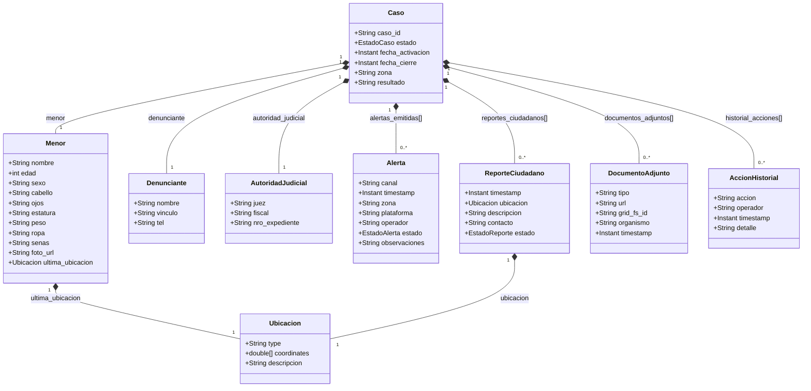
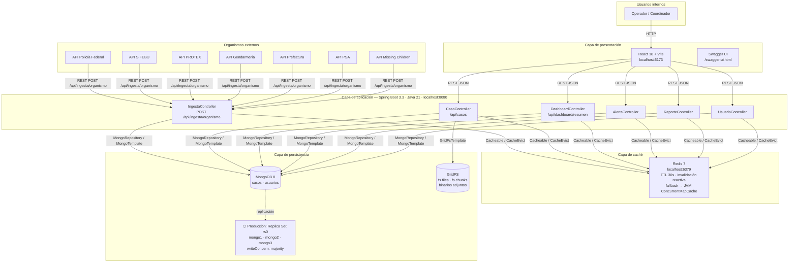
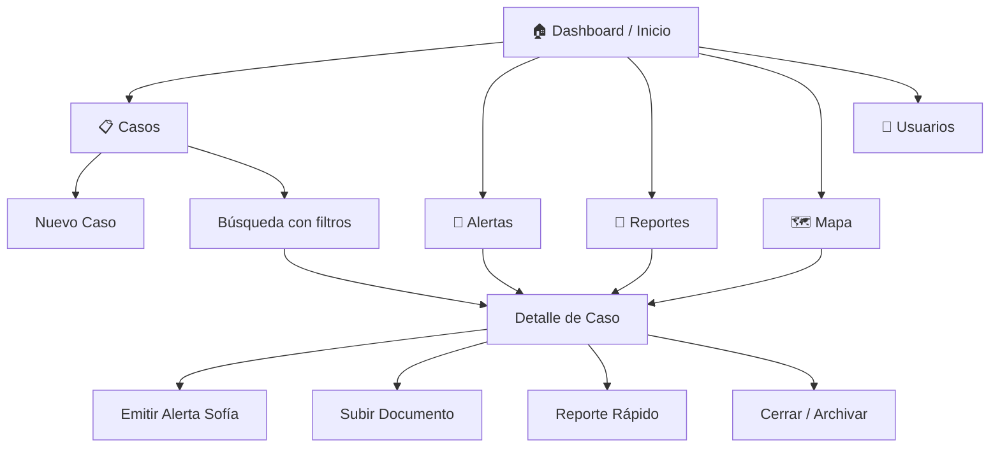
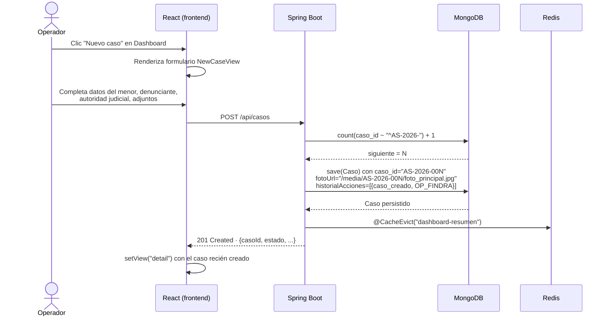
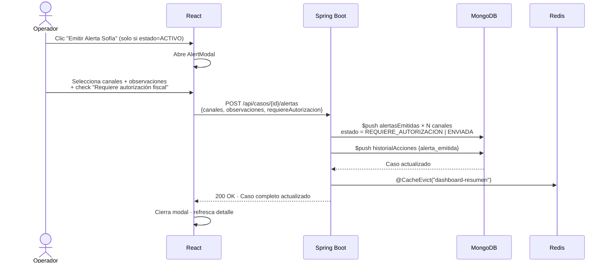
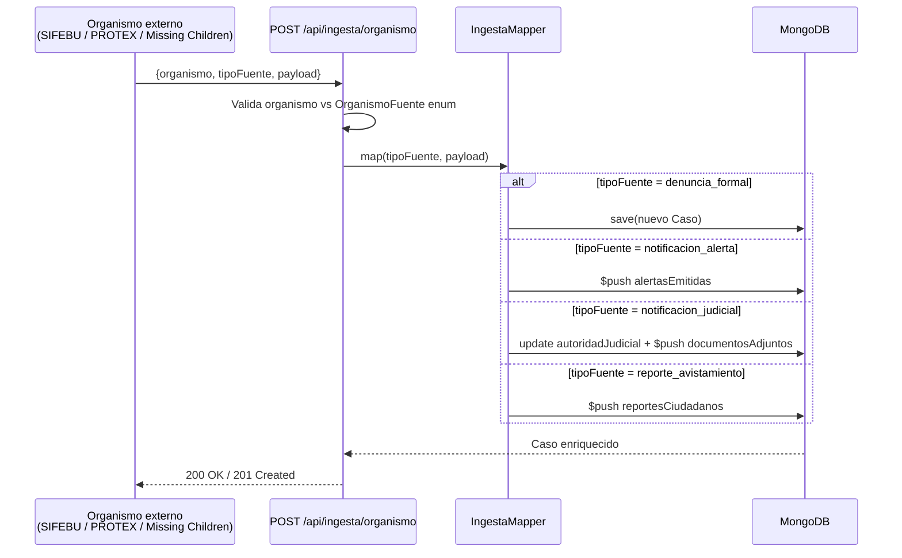
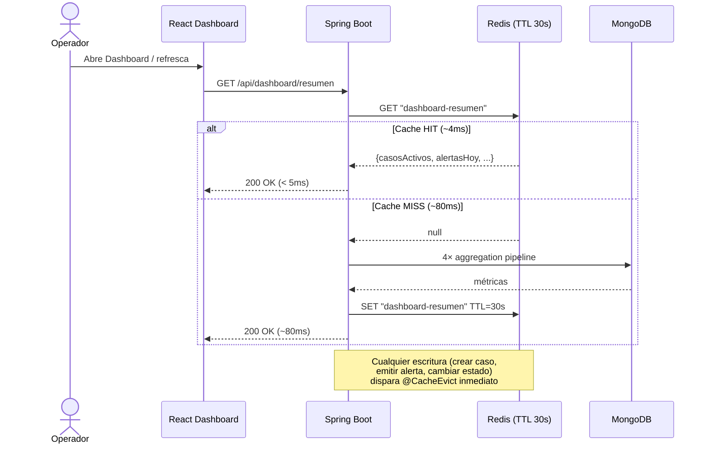
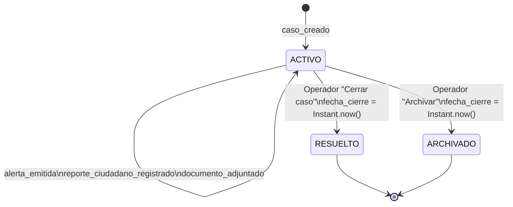

# FINDRA
## Sistema Inteligente de Búsqueda y Alerta
### "Cada segundo importa. Cada dato salva."

---

**Materia:** Ingeniería de Datos II
**Trabajo:** TP Integrador — Entrega Final
**Eje temático:** Protocolo Alerta Sofía — Argentina
**Año:** 2026

**Grupo 3:**
- Andrés Felipe Méndez Florez
- Aylen Solana Nahuel
- Ignacio Lapolla
- Jonathan Dominguez
- Matias Marcon

**Stack tecnológico:**
Java 21 · Spring Boot 3.3 · MongoDB 8 · Redis 7 · React 18 · Vite · OpenAPI 3.0

---

## 1. Introducción y Contexto del Problema

En la República Argentina, las estadísticas registran un promedio de 7.000 reportes anuales de menores desaparecidos. Si bien la mayor proporción de estos casos se esclarece durante las primeras 72 horas, aquellas situaciones que revisten un riesgo vital inminente demandan un despliegue estatal rápido, masivo y coordinado. Con este propósito, el Ministerio de Seguridad de la Nación implementó en 2019 el Protocolo Alerta Sofía, un mecanismo de emergencia diseñado para articular los esfuerzos de las fuerzas federales, el sistema judicial, los medios de comunicación y la sociedad civil frente a la desaparición de niñas, niños y adolescentes (NNyA).

No obstante su relevancia institucional, la operatividad del protocolo se encuentra obstaculizada por limitaciones tecnológicas de carácter estructural:

- **Fragmentación interinstitucional:** Las distintas dependencias involucradas (Policía Federal, Gendarmería, SIFEBU y fiscalías) operan con bases de datos y sistemas de gestión independientes, carentes de interoperabilidad.
- **Latencia en la activación:** Los procesos burocráticos de validación y difusión generan demoras significativas, extendiendo a horas un procedimiento que requiere inmediatez.
- **Heterogeneidad de los datos:** La evidencia recolectada —fotografías, datos biométricos, fojas judiciales, coordenadas GPS, testimonios— carece de una estructura estandarizada que facilite su procesamiento cruzado.
- **Ausencia de trazabilidad:** El sistema actual no dispone de un registro unificado que permita auditar de manera transparente las intervenciones realizadas sobre un expediente en curso.

Como respuesta surge **FINDRA**, una plataforma GovTech de gestión centralizada que optimiza los tiempos de respuesta del Protocolo Alerta Sofía mediante bases de datos NoSQL, arquitecturas distribuidas e integraciones interinstitucionales en tiempo real.

---

## 2. Definición del Problema

**Enunciado:** Los organismos encargados de ejecutar el Protocolo Alerta Sofía carecen de una infraestructura tecnológica unificada que permita gestionar casos en tiempo real, procesar datos heterogéneos provenientes de múltiples fuentes y garantizar la trazabilidad de las acciones operativas. Esta deficiencia genera latencias críticas y pérdida de información en escenarios de emergencia donde el factor temporal es determinante para preservar la vida del menor.

### 2.1 Dimensión Institucional

En la ejecución del protocolo intervienen actores de diversa naturaleza operativa y jurisdiccional: el Ministerio de Seguridad de la Nación, el SIFEBU, las cuatro fuerzas federales (Gendarmería, Prefectura, Policía Federal y PSA), el Ministerio Público Fiscal (a través de PROTEX), la ONG Missing Children y los medios de comunicación. En la actualidad, estas entidades operan en "silos de información", sin un sistema común que permita el acceso simultáneo y sincronizado a los expedientes.

### 2.2 Dimensión de los Datos

La información que alimenta un caso activo posee alta entropía y es inherentemente polimórfica: fotografías, datos biométricos, testimonios de denunciantes, coordenadas geográficas (GPS), documentos judiciales en formato texto y reportes ciudadanos no estructurados. Esta variabilidad hace que los esquemas de bases de datos relacionales tradicionales resulten rígidos e ineficientes para el cruce ágil de información.

### 2.3 Dimensión Temporal

En el ámbito de las búsquedas de personas, la "ventana de oportunidad" es crítica: las primeras horas son estadísticamente las más determinantes para un desenlace favorable. Cualquier latencia técnica en la validación de datos, la activación de la alarma o la coordinación de las fuerzas impacta negativamente en la efectividad del protocolo.

### 2.4 Relevancia del Problema

La pertinencia de abordar este problema trasciende el ejercicio académico. Responde a una necesidad operativa real y documentada, respaldada por la normativa nacional (Resolución MS N° 208/2019). El desarrollo de una solución orientada a datos busca proveer a los organismos estatales de las herramientas tecnológicas que hoy les faltan para cumplir su misión de manera eficaz.

---

## 3. Modelado de Datos (NoSQL)

### 3.1 Modelo adoptado: documento embebido en MongoDB

FINDRA utiliza un modelo orientado a documentos donde cada caso activo del Protocolo Alerta Sofía se representa como un único documento JSON autocontenido en MongoDB. Todos los sub-documentos (alertas, reportes, documentos adjuntos, historial de acciones) son **arrays embebidos** dentro del documento `Caso`, no colecciones separadas.

El criterio de diseño central fue el **patrón de acceso dominante**: en un sistema de emergencias, la operación más frecuente es "dame todo lo que sé del caso AS-2026-001 ahora mismo". Con embedding, esa operación es una lectura O(1) de un único documento. Las escrituras incrementales de cada organismo son `$push` atómicos sobre arrays del mismo documento — sin joins, sin transacciones multi-colección, sin migraciones de esquema ante nuevos tipos de dato.

El embedding tiene un límite de 16 MB por documento en MongoDB. Para FINDRA no es un riesgo real: un caso del Protocolo Alerta Sofía tiene un ciclo de vida acotado (horas o días) y la cantidad de alertas, reportes y acciones que puede acumular está muy por debajo del límite. Si los arrays de reportes ciudadanos crecieran de forma masiva en producción, la solución es extraerlos a una colección separada con referencia por `casoId` — sin cambios en la API ni en el resto del modelo.

**Estructura del documento principal:**

```json
{
  "_id": "ObjectId('64f1a2b3c4d5e6f7a8b9c0d1')",
  "caso_id": "AS-2026-A3F2B1",
  "estado": "ACTIVO",
  "fecha_activacion": "2026-04-15T10:30:00Z",
  "fecha_cierre": null,
  "resultado": null,
  "zona": "CABA",
  "menor": {
    "nombre": "María Fernanda López",
    "edad": 8,
    "sexo": "F",
    "cabello": "Castaño, largo",
    "ojos": "Marrones",
    "estatura": "1.20 m",
    "peso": "28 kg",
    "ropa": "Remera rosa, jeans azul",
    "senas": "Lunar en mejilla derecha",
    "foto_url": "/media/AS-2026-A3F2B1/foto_principal.jpg",
    "ultima_ubicacion": {
      "type": "Point",
      "coordinates": [-58.3816, -34.6037],
      "descripcion": "Plaza Constitución, CABA"
    }
  },
  "denunciante": {
    "nombre": "Laura López",
    "vinculo": "madre",
    "tel": "+54 11 5555-1234"
  },
  "autoridad_judicial": {
    "juez": "Dr. Carlos Méndez",
    "fiscal": "Dra. Ana Rodríguez",
    "nro_expediente": "JF-2026-00412"
  },
  "alertas_emitidas": [
    {
      "canal": "SMS_masivo",
      "zona": "CABA",
      "timestamp": "2026-04-15T10:35:00Z",
      "plataforma": "SIFEBU",
      "operador": "SIFEBU",
      "estado": "ENVIADA",
      "observaciones": null
    },
    {
      "canal": "redes_sociales",
      "zona": "CABA",
      "timestamp": "2026-04-15T10:37:00Z",
      "plataforma": "Facebook",
      "operador": "SIFEBU",
      "estado": "REQUIERE_AUTORIZACION",
      "observaciones": "Pendiente aprobación coordinador"
    }
  ],
  "reportes_ciudadanos": [
    {
      "timestamp": "2026-04-15T11:10:00Z",
      "ubicacion": {
        "type": "Point",
        "coordinates": [-58.3790, -34.6050]
      },
      "descripcion": "Niña vista cerca del subte Línea C",
      "contacto": "anonimo@ciudadano.ar",
      "estado": "VERIFICADO"
    }
  ],
  "documentos_adjuntos": [
    {
      "tipo": "denuncia_policial",
      "url": "denuncia_pfa.pdf",
      "grid_fs_id": "64f1a2b3c4d5e6f7a8b9c0d2",
      "organismo": "PFA",
      "timestamp": "2026-04-15T10:32:00Z"
    }
  ],
  "historial_acciones": [
    {
      "accion": "caso_creado",
      "operador": "PFA",
      "timestamp": "2026-04-15T10:30:00Z",
      "detalle": "Denuncia formal ingresada desde PFA"
    },
    {
      "accion": "alerta_emitida",
      "operador": "SIFEBU",
      "timestamp": "2026-04-15T10:35:00Z",
      "detalle": "Notificacion de alerta recibida de SIFEBU"
    }
  ]
}
```

**Anatomía del documento — campos clave:**

| Campo | Tipo MongoDB | Descripción | Notas de diseño |
|---|---|---|---|
| `_id` | ObjectId | Clave primaria generada por MongoDB | Inmutable, indexado por defecto |
| `caso_id` | String | Identificador legible del caso (`AS-YYYY-XXXXXX`) | Índice único; usado en todas las referencias interinstitucionales |
| `estado` | String (enum) | Ciclo de vida del caso: `ACTIVO` / `RESUELTO` / `ARCHIVADO` | Controla qué operaciones están habilitadas en la UI |
| `fecha_activacion` | Date (ISODate) | Timestamp de creación del caso | Ordenamiento por defecto en el dashboard |
| `fecha_cierre` | Date (ISODate) | Timestamp de resolución o archivo | `null` mientras el caso está activo; asignado automáticamente en la transición |
| `zona` | String | Jurisdicción geográfica del caso | Filtro operativo frecuente (índice compuesto con `estado`) |
| `menor` | Object embebido | Datos biométricos + última ubicación GPS del menor | Sub-documento único; incluye coordenadas GeoJSON para índice 2dsphere |
| `denunciante` | Object embebido | Datos de contacto del denunciante | Sub-documento único; no varía después de la creación |
| `autoridad_judicial` | Object embebido | Juez, fiscal y número de expediente | Actualizable por ingesta `notificacion_judicial` de PROTEX |
| `alertas_emitidas` | Array de objetos | Canales de alerta activados con estado y timestamp | Crece via `$push`; nunca se sobreescribe |
| `reportes_ciudadanos` | Array de objetos | Avistamientos con coordenadas GeoJSON y estado | Crece via `$push`; índice 2dsphere sobre `ubicacion` |
| `documentos_adjuntos` | Array de objetos | Referencias a binarios en GridFS (`grid_fs_id`) | Solo almacena el `ObjectId` de referencia; el binario vive en `fs.chunks` |
| `historial_acciones` | Array de objetos | Log cronológico de todas las operaciones sobre el caso | Append-only; base de la auditoría; nunca se modifica ni elimina |

### 3.2 Índices definidos

Los índices se diseñaron a partir de los patrones de consulta reales del sistema — no de forma genérica. Cada índice resuelve una operación concreta que el sistema ejecuta con alta frecuencia o que tiene impacto crítico en la latencia.

```javascript
// 1. Acceso principal — lookup directo por identificador de caso
db.casos.createIndex({ "caso_id": 1 }, { unique: true })

// 2. Filtros operativos — búsqueda por estado ordenada cronológicamente
db.casos.createIndex({ "estado": 1, "fecha_activacion": -1 })

// 3. Filtro biométrico — búsqueda por características del menor
db.casos.createIndex({ "menor.edad": 1, "menor.sexo": 1 })

// 4. Geoespacial — última ubicación conocida del menor
db.casos.createIndex({ "menor.ultima_ubicacion": "2dsphere" })

// 5. Geoespacial — ubicaciones de reportes ciudadanos
db.casos.createIndex({ "reportes_ciudadanos.ubicacion": "2dsphere" })

// 6. Auditoría — trazabilidad por operador en el historial
db.casos.createIndex({ "historial_acciones.operador": 1 })
```

**Descripción y justificación de cada índice:**

| # | Campos indexados | Tipo | Consulta que resuelve | Por qué este índice |
|---|---|---|---|---|
| 1 | `caso_id` | Único ASC | `GET /api/casos/{id}` — lookup directo por identificador | Es la clave de acceso primaria en todas las operaciones interinstitucionales. Sin índice, cada lookup escanea la colección completa. Único para garantizar que no existan dos casos con el mismo ID. |
| 2 | `estado` + `fecha_activacion` | Compuesto ASC/DESC | `GET /api/casos?estado=ACTIVO` — lista del dashboard ordenada por fecha | El filtro más frecuente del sistema: el operador siempre trabaja con casos activos ordenados del más reciente al más antiguo. El índice compuesto resuelve filtro + orden en una sola operación de índice. |
| 3 | `menor.edad` + `menor.sexo` | Compuesto ASC | Búsqueda biométrica — filtrar casos por rango de edad y sexo del menor | Permite cruzar avistamientos ciudadanos ("vi una nena de unos 8 años") con casos activos sin escanear todos los documentos. Índice sobre campos de sub-documento embebido, funcionalidad nativa de MongoDB. |
| 4 | `menor.ultima_ubicacion` | 2dsphere | `GET /api/casos?cerca=[-58.38,-34.60]&radio=5km` — mapa de casos activos | Habilita consultas geoespaciales nativas (`$near`, `$geoWithin`) sobre la última coordenada GPS conocida del menor. Requiere formato GeoJSON `{type: "Point", coordinates: [lng, lat]}`. |
| 5 | `reportes_ciudadanos.ubicacion` | 2dsphere | Búsqueda de avistamientos en un área geográfica | Mismo mecanismo que el índice 4 pero aplicado a los reportes ciudadanos dentro del array embebido. MongoDB soporta índices 2dsphere sobre arrays de sub-documentos con coordenadas GeoJSON. |
| 6 | `historial_acciones.operador` | ASC | `GET /api/auditoria?operador=SIFEBU` — trazabilidad por organismo | Permite auditar todas las acciones realizadas por un organismo específico sin escanear el historial completo de todos los casos. Índice sobre campo de array embebido — MongoDB indexa cada elemento del array de forma individual. |

### 3.3 Justificación del modelo — modelos evaluados y descartados

Se evaluaron tres enfoques antes de adoptar el embedding completo en MongoDB:

**Modelo relacional (PostgreSQL):** cada entidad en su propia tabla (`casos`, `alertas`, `reportes`, `documentos`, `historial`). Descartado porque la consulta dominante requeriría entre 4 y 6 JOINs, el esquema rígido obliga a migraciones cada vez que un organismo incorpora un nuevo tipo de dato, y las búsquedas geoespaciales requieren la extensión PostGIS con queries adicionales — complejidad innecesaria para el dominio.

**NoSQL con colecciones separadas y referencias (MongoDB):** cada sub-entidad en su propia colección, referenciada por `casoId`. Descartado porque, aunque mejora la flexibilidad de esquema respecto al modelo relacional, no resuelve el problema de latencia: la consulta dominante seguiría requiriendo múltiples `$lookup` encadenados, y las escrituras consistentes entre colecciones requerirían transacciones multi-documento con su overhead de coordinación.

**NoSQL con embedding completo (MongoDB) — modelo adoptado:** todo el caso vive en un único documento. Resuelve los problemas de ambas alternativas sin sus costos.

| Requerimiento | Relacional | Referencias NoSQL | Embedding (adoptado) |
|---|---|---|---|
| Lectura completa del caso | 4–6 JOINs | 4–6 `$lookup` | O(1) — un documento |
| Escritura incremental por organismo | INSERT en múltiples tablas + transacción | Update en múltiples colecciones + transacción | `$push` atómico en el mismo documento |
| Datos polimórficos por fuente | Migraciones por cada nuevo tipo | Schema flexible ✓ | Schema flexible ✓ |
| Búsqueda geoespacial | PostGIS + query compleja | 2dsphere ✓ | 2dsphere sobre sub-documentos ✓ |
| Trazabilidad de acciones | Tabla `historial` separada + JOIN | Colección `historial` + `$lookup` | Array `historial_acciones` append-only en el mismo documento |
| Consistencia en escrituras críticas | Transacción ACID multi-tabla | Transacción multi-colección | Atómica a nivel documento; sin transacciones |
| Ciclo de vida del caso | Estado + fecha en tabla principal | Sincronización entre colecciones | `estado` + `fecha_cierre` en el mismo documento; transición en una escritura |
| Escalabilidad del modelo | Sharding por tabla | Sharding por colección | Límite 16 MB/doc — controlado por ciclo de vida acotado del caso |

### 3.4 Diagrama del modelo de datos



Todo el modelo vive en un único documento MongoDB (`@Document(collection = "casos")`). Los sub-documentos son clases Java embebidas — no colecciones separadas, no referencias. La consistencia es atómica a nivel documento.

---

## 4. Arquitectura del Sistema

### 4.1 Capas de la arquitectura

FINDRA adopta una **arquitectura monolítica en capas** desplegada localmente. Esta decisión es deliberada y apropiada para el contexto académico: el foco del trabajo es el motor de base de datos NoSQL y el pipeline de datos, no la complejidad operativa de infraestructura distribuida. Un monolito bien estructurado en capas permite demostrar con claridad la separación de responsabilidades, la lógica de negocio y el modelo de datos sin introducir overhead de comunicación entre servicios que no aportaría valor al objetivo de la materia.

La estructura interna del monolito respeta una separación estricta en capas con dependencias unidireccionales: `Controller → Service → Repository → Model`. Ninguna capa accede a la inmediatamente superior, y los DTOs actúan como contratos de interfaz entre la capa de presentación y la de aplicación. Esta separación es la misma que se aplicaría en una arquitectura de microservicios — la diferencia es que aquí todo corre en el mismo proceso, lo que simplifica el despliegue sin sacrificar la claridad del diseño.

En un entorno de producción real, las capas de ingesta y procesamiento podrían extraerse como microservicios independientes sin cambios en el modelo de datos ni en los contratos REST — la frontera entre capas ya está definida en el código.

**Capa de ingesta y fuentes de datos**
Endpoint REST unificado (`POST /api/ingesta/organismo`) que recibe payloads de los 7 organismos participantes del protocolo. Cada payload se mapea al modelo canónico FINDRA según su `tipoFuente`, enriqueciendo el documento `Caso` de forma incremental sin sobrescribir datos existentes.

**Capa de procesamiento y lógica de negocio**
Spring Boot 3.3 con Java 21. Valida, sanitiza y persiste los datos entrantes. Implementa las reglas del protocolo: verificación de requisitos de activación, registro automático del historial de acciones y emisión de Alertas Sofía por canales configurables.

**Capa de caché**
Redis 7 como caché del resumen del dashboard (`GET /api/casos/resumen`). TTL de 30 segundos con invalidación reactiva mediante `@CacheEvict` ante cualquier escritura sobre casos. Reduce la carga sobre MongoDB para la consulta de mayor frecuencia del sistema.

**Capa de persistencia NoSQL**
MongoDB 8 como motor principal. En producción: Replica Set de 3 nodos (`rs0`) con `writeConcern: majority` para alta disponibilidad y failover automático. En desarrollo local: instancia única. El cambio entre ambos entornos es exclusivamente de configuración (`MONGODB_URI`), sin modificaciones en el código.

**Capa de presentación**
Dashboard React 18 + Vite consumiendo la API REST. Incluye: métricas en tiempo real, buscador con filtros, detalle de caso con mapa de coordenadas reales, formulario de alta, emisión de alertas y cierre/archivo de casos.

**[FIGURA — Diagrama de arquitectura propuesta (Parcial 1)]**
*Diseño conceptual inicial: pipeline de ingesta multi-organismo con validación, normalización y deduplicación hacia el backend REST y MongoDB. La implementación final conserva esta estructura y la expande con Redis, GridFS, el fallback de caché y los 7 organismos reales del protocolo — ver §4.4.*

### 4.2 Decisiones arquitectónicas clave

| Decisión | Alternativa descartada | Razón |
|---|---|---|
| Monolito en capas | Microservicios | Complejidad operativa desproporcionada para el alcance académico; las fronteras entre capas están definidas y permiten extracción futura sin cambios en el modelo |
| Replica Set 3 nodos (prod) | Instancia standalone | Sin failover automático; en emergencias la disponibilidad no es negociable |
| Redis con invalidación reactiva | TTL puro | TTL puro puede devolver datos desactualizados; la invalidación por escritura garantiza consistencia inmediata |
| Endpoint de ingesta unificado | API por organismo | N endpoints implica N contratos; el endpoint único centraliza la ingesta y permite agregar organismos sin cambiar el contrato |
| Embedding completo | Colecciones separadas + referencias | La consulta dominante requiere el caso completo; embedding lo resuelve en O(1) sin joins ni transacciones multi-colección |

**Replica Set sobre instancia standalone**
En un sistema de emergencias, la disponibilidad no es negociable. El Replica Set con 3 nodos garantiza failover automático: si el nodo primario falla, un secundario asume el rol sin intervención manual. Las escrituras críticas usan `writeConcern: majority`, asegurando confirmación en al menos 2 nodos antes de responder al cliente.

**Redis con invalidación reactiva**
Se priorizó consistencia sobre simplicidad de TTL. Cada operación de escritura (crear caso, cambiar estado, emitir alerta, registrar reporte) invalida el caché del dashboard inmediatamente. Esto garantiza que el dashboard refleje siempre el estado real sin necesidad de TTL corto ni polling.

**Endpoint de ingesta unificado**
En lugar de APIs punto a punto por organismo, un único contrato REST centraliza la ingesta. Los organismos solo necesitan conocer el endpoint, su `organismo` y el `tipoFuente` correcto. El sistema resuelve el mapeo internamente, lo que simplifica la integración y permite agregar organismos nuevos sin cambios en el contrato.

**Embedding completo sobre referencias**
Todos los sub-documentos del caso viven en el mismo documento MongoDB. Esto elimina joins, garantiza consistencia atómica y reduce la latencia de lectura a una sola operación de disco.

### 4.3 Análisis de dependencias del sistema

Se realizó un análisis estático completo del repositorio para validar la cohesión arquitectónica del código implementado. El grafo resultante comprende **622 nodos** (522 extraídos por AST + 100 conceptos semánticos de documentación) y **1.097 relaciones**, agrupados en **50 comunidades** detectadas mediante el algoritmo de Louvain.

Las 50 comunidades se corresponden directamente con las capas de la arquitectura: controllers, services, mappers, modelos, DTOs, repositorios, configuración y frontend. La densidad de relaciones (~1.76 relaciones por nodo) es consistente con un sistema modular donde cada clase tiene responsabilidades acotadas.

**[FIGURA — Grafo de dependencias del sistema]**
*Grafo generado por análisis AST estático del repositorio. Cada nodo es un archivo o concepto; los colores indican la comunidad (módulo lógico) al que pertenece. El grafo completo e interactivo está disponible en `docs/graph.html`.*

### 4.4 Diagrama de componentes (C4 — Nivel 2)



---

## 5. Selección y Justificación Tecnológica

### 5.1 Comparativa de motores NoSQL

Se evaluaron todas las familias de bases de datos NoSQL en función de los requerimientos concretos del sistema. El criterio central fue el mismo que guió el modelado: el patrón de acceso dominante es la lectura completa de un caso con datos heterogéneos provenientes de múltiples organismos.

| Motor | Tipo | Caso de uso ideal | Por qué no aplica a FINDRA | Decisión |
|---|---|---|---|---|
| **MongoDB 8** | Documentos | Datos semi-estructurados, variables y polimórficos con múltiples patrones de consulta | Cubre todos los requerimientos del sistema sin restricciones | **SELECCIONADO** |
| Apache Cassandra | Columnar | Escrituras masivas distribuidas (IoT, logs) a escala de millones de registros/segundo | Query-driven design obliga a modelar una tabla por patrón de consulta — FINDRA tiene 6 patrones distintos, lo que implicaría duplicación masiva de datos | Descartado |
| Neo4j | Grafos | Traversal de relaciones complejas entre entidades (redes sociales, grafos de conocimiento) | Las entidades de FINDRA (caso, menor, alerta, reporte) no forman un grafo — son sub-documentos de un mismo objeto, no nodos interconectados | Descartado |
| Redis | Clave-Valor | Caché, sesiones y estructuras de datos en memoria de alta velocidad | Sin capacidad de consultas estructuradas, índices geoespaciales ni persistencia durable como motor principal | Caché, no BD principal |
| HBase | Columnar (Hadoop) | Analítica de big data a escala de petabytes sobre HDFS | Complejidad operativa (ZooKeeper, HDFS, HMaster) desproporcionada para el volumen actual; sin soporte nativo para documentos embebidos ni consultas geoespaciales | Descartado |

### 5.2 Por qué MongoDB es la elección correcta para FINDRA

La materia es Ingeniería de Datos II con eje en NoSQL — la elección del motor no es periférica al trabajo, es su núcleo. Cada característica de MongoDB que se lista a continuación resuelve un problema concreto del dominio, no es una ventaja genérica del motor.

**Schema flexible — absorbe la heterogeneidad real del protocolo**
Los 7 organismos del Protocolo Alerta Sofía envían datos estructuralmente distintos: PFA envía una denuncia formal con datos biométricos, SIFEBU envía una notificación de alerta con canales y zonas, PROTEX envía documentos judiciales con número de expediente, Missing Children envía reportes de avistamiento con coordenadas GPS. En un esquema relacional, cada tipo requeriría su propia tabla y un JOIN para ensamblar el caso. En MongoDB, el schema flexible del documento `Caso` absorbe todos los tipos sin migraciones — agregar un octavo organismo con un nuevo tipo de dato no requiere alterar el modelo.

**Consultas ricas sobre documentos embebidos — sin joins ni extensiones**
MongoDB ejecuta filtros sobre campos anidados a cualquier profundidad, índices 2dsphere sobre coordenadas GeoJSON dentro de arrays embebidos, y aggregation pipelines que calculan métricas del dashboard (conteos por estado, alertas del día, resoluciones del mes) directamente en el motor sin transferir datos a la JVM. En PostgreSQL, las búsquedas geoespaciales requerirían la extensión PostGIS y queries adicionales; los datos embebidos como `menor.ultima_ubicacion` no tendrían representación natural en tablas.

**Alta disponibilidad nativa — crítica para un sistema de emergencias**
El Replica Set con 3 nodos y `writeConcern: majority` garantiza que cada escritura está confirmada en al menos 2 nodos antes de responder al cliente. Si el nodo primario falla, la elección automática de un secundario ocurre en segundos sin intervención manual. En un sistema donde la indisponibilidad puede impactar directamente en la búsqueda de un menor, este comportamiento no es opcional.

**ACID a nivel documento — consistencia sin overhead de transacciones**
Todas las escrituras sobre un caso — agregar una alerta, registrar un reporte, actualizar el estado, registrar la acción en el historial — ocurren sobre el mismo documento MongoDB y son atómicas por definición. La consistencia que en un modelo relacional requeriría una transacción multi-tabla está garantizada estructuralmente por el embedding.

**Ecosistema Java maduro — integración directa con Spring Boot**
Spring Data MongoDB provee `MongoRepository` con query derivation, `MongoTemplate` para operaciones avanzadas (`$push`, `$set`, aggregations), `GridFsTemplate` para almacenamiento de binarios y soporte nativo para `@Cacheable` con Redis. La integración no requiere adaptadores ni ORMs adicionales — el stack es coherente de punta a punta.

### 5.3 Comparativa del stack completo

| Dimensión | Alternativa evaluada | Decisión FINDRA | Justificación |
|---|---|---|---|
| Base de datos | PostgreSQL (relacional) | **MongoDB 8** | 7 organismos con estructuras de datos distintas hacen el esquema relacional rígido e ineficiente; datos geoespaciales, binarios (GridFS) y schema flexible son nativos en MongoDB sin extensiones |
| Caché | Caffeine (in-process) | **Redis 7** | Caffeine es in-process: no provee coherencia entre múltiples instancias del API; Redis centraliza la invalidación reactiva y es preparado para escala horizontal |
| Alta disponibilidad | Sharding por zona | **Replica Set rs0** | Sharding agrega complejidad operativa alta (balanceo, config servers, mongos) para el volumen actual; Replica Set provee failover automático a menor costo operativo |
| Frontend | Angular 17 | **React 18 + Vite** | Angular introduce mayor complejidad estructural (módulos, decoradores, RxJS) innecesaria para el alcance del dashboard; Vite reduce tiempos de build y HMR al mínimo |
| Runtime backend | Java 17 LTS | **Java 21 LTS** | Soporte LTS hasta 2031; Virtual Threads (Project Loom) disponibles para futura mejora de concurrencia sin refactor; Records simplifican los DTOs eliminando boilerplate |
| Modelo de datos | Referencias entre colecciones | **Embedding completo** | Patrón de acceso dominante es lectura completa del caso; embedding resuelve en O(1) lo que con referencias requeriría 4–6 `$lookup` encadenados |

---

## 6. Pipeline de Datos End-to-End (E2E)

### 6.1 Flujo A — Ingesta multi-organismo

Los 7 organismos participantes del Protocolo Alerta Sofía ingresan datos mediante un único endpoint REST:

```
POST /api/ingesta/organismo
Content-Type: application/json

{
  "organismo": "PFA",
  "tipoFuente": "denuncia_formal",
  "payload": { ... }
}
```

El campo `tipoFuente` determina la acción sobre el documento `Caso` en MongoDB:

| tipoFuente | Organismo típico | Acción en MongoDB |
|---|---|---|
| `denuncia_formal` | PFA, Gendarmería, Prefectura, PSA | Crea nuevo documento `Caso` |
| `notificacion_alerta` | SIFEBU | `$push` a `alertasEmitidas` |
| `notificacion_judicial` | PROTEX | Actualiza `autoridadJudicial` + `$push` a `documentosAdjuntos` |
| `reporte_avistamiento` | Missing Children | `$push` a `reportesCiudadanos` |

Cada ingesta enriquece el mismo documento `Caso` de forma incremental. Un caso puede recibir payloads de múltiples organismos en cualquier orden, reflejando la coordinación interinstitucional real del protocolo.

**Validaciones de seguridad en el pipeline:**
- `organismo` validado contra enum `OrganismoFuente` — rechaza organismos no reconocidos con HTTP 400
- URLs de documentos y fotos validadas con patrón `SAFE_URL` — bloquea esquemas `javascript:`, `file:`, `data:`
- Campos de texto libre sanitizados — elimina caracteres de control (`\r\n\t`) y aplica límite de longitud

### 6.2 Flujo B — Operación desde el frontend

```
Operador abre dashboard
  → GET /api/casos/resumen
    → Redis HIT (TTL 30s)  → respuesta < 5ms
    → Redis MISS           → MongoDB aggregation → SET Redis → respuesta ~80ms

Operador emite Alerta Sofía
  → POST /api/casos/{id}/alertas  {canales: [...]}
    → CasoService: $push alertasEmitidas + $push historialAcciones
    → @CacheEvict: invalida dashboard-resumen en Redis

Operador cierra o archiva caso
  → PATCH /api/casos/{id}/estado  {estado: "RESUELTO"|"ARCHIVADO", resultado: "..."}
    → CasoService: actualiza estado + fecha_cierre (Instant.now()) + $push historialAcciones
    → @CacheEvict: invalida dashboard-resumen en Redis
```

La invalidación reactiva garantiza que el dashboard refleje el estado real tras cualquier escritura, sin polling ni TTL agresivo.

### 6.3 Diagramas de secuencia

Los diagramas de secuencia detallados de ambos flujos se encuentran en la **§10 Guía Funcional**:

| Flujo | Diagrama |
|---|---|
| Flujo A — Registro de caso nuevo | §10.2 |
| Flujo B — Emisión de Alerta Sofía | §10.3 |
| Flujo C — Ingesta multi-organismo vía API | §10.4 |
| Flujo D — Dashboard con caché Redis (ciclo HIT/MISS) | §10.5 |
| Flujo E — Cierre o archivo de caso | §10.6 |
| Flujo F — Subida y descarga de documentos (GridFS) | §10.7 |

---

## 7. Calidad y Performance

### 7.1 Tests unitarios

Se implementaron 5 tests unitarios sobre `CasoService` usando JUnit 5 + Mockito 5 con `ByteBuddyMockMaker` (requerido para compatibilidad con Java 21):

| Test | Qué verifica |
|---|---|
| `crearCasoSetearFechaActivacionYEstadoActivo` | El caso creado tiene `estado=ACTIVO` y `fechaActivacion` no nula |
| `actualizarEstadoCambiaEstadoYRegistraHistorial` | El cambio de estado persiste y agrega una entrada al historial |
| `registrarReporteAgregaReporteYHistorial` | El reporte ciudadano se agrega al array y se registra en el historial |
| `buscarFiltrarPorEstadoInvocaMongoTemplate` | El filtro por estado construye el query correcto contra MongoDB |
| `emitirAlertasAgregaAlertasAlCaso` | Las alertas se agregan al array con estado `ENVIADA` |

Ejecución: `cd backend && mvn test`

### 7.2 Optimizaciones de performance implementadas

Las siguientes optimizaciones fueron identificadas, corregidas e incorporadas al código durante el desarrollo. Cada una tiene impacto medible en latencia o consumo de memoria bajo carga.

#### 7.2.1 `mongoTemplate.count()` en lugar de carga completa de documentos

**Problema original:** `DashboardService.contarAlertasDesde()` ejecutaba `mongoTemplate.find(query, Caso.class).stream().flatMap(...).count()`, lo que cargaba todos los documentos `Caso` coincidentes a memoria JVM para contarlos.

**Impacto:** Con 10.000 casos activos, esa operación podía transferir decenas de MB desde MongoDB al heap de la JVM en cada llamada al dashboard.

**Fix aplicado:** Reemplazado por `mongoTemplate.count(query, Caso.class)`, que ejecuta un `countDocuments` nativo en MongoDB — devuelve un único entero sin transferir documentos.

```java
// Antes — carga todos los documentos a memoria
mongoTemplate.find(query, Caso.class).stream().flatMap(...).count()

// Después — conteo en el motor, O(1) en memoria JVM
mongoTemplate.count(query, Caso.class)
```

#### 7.2.2 `limit(100)` en queries de resumen

**Problema original:** `obtenerResumenAlertas()` y `obtenerResumenReportes()` no tenían límite superior. Con miles de casos con alertas, el resultado podía ser un conjunto ilimitado de documentos cargados en memoria para construir los DTOs.

**Fix aplicado:** Ambas queries aplican `.limit(100)` antes de ejecutar, acotando el conjunto de trabajo a los 100 casos más recientes con alertas/reportes respectivamente.

```java
query.with(Sort.by(Sort.Direction.DESC, "fecha_activacion")).limit(100);
```

#### 7.2.3 Bounds de paginación en búsqueda de casos

**Problema original:** El endpoint `GET /api/casos?size=N` aceptaba cualquier valor de `size`, permitiendo que un cliente malicioso o un bug en el frontend solicitara 10.000 resultados por página.

**Fix aplicado:** `CasoService.buscar()` aplica bounds explícitos: mínimo 1, máximo 50 resultados por página.

```java
int boundedSize = Math.min(Math.max(size, 1), 50);
query.with(PageRequest.of(Math.max(page, 0), boundedSize));
```

#### 7.2.4 `Pattern.quote()` para prevenir ReDoS en búsqueda de texto

**Problema original:** La búsqueda por texto libre construía un regex MongoDB directamente desde el input del usuario sin escapar metacaracteres. Un input como `(((` generaba un regex inválido o potencialmente catastrófico (ReDoS — Regular Expression Denial of Service).

**Fix aplicado:** `Pattern.quote()` escapa todos los metacaracteres del input antes de compilar el regex, garantizando que el texto se trate siempre como literal.

```java
Pattern pattern = Pattern.compile(Pattern.quote(texto.trim()), Pattern.CASE_INSENSITIVE);
```

#### 7.2.5 Fallback de Redis a caché en memoria

**Problema original:** Si Redis no está disponible al iniciar la aplicación, Spring lanza una excepción y el sistema no arranca.

**Fix aplicado:** `CacheConfig` detecta si Redis está disponible y cae a `ConcurrentMapCacheManager` (caché in-process de la JVM) si no lo está. El sistema funciona en todos los entornos sin Redis como dependencia dura.

```java
@Bean
public CacheManager cacheManager(RedisConnectionFactory factory) {
    try {
        factory.getConnection().close();
        // Redis disponible → RedisCacheManager con TTL 30s
        return RedisCacheManager.builder(factory)
            .withCacheConfiguration("dashboard-resumen",
                RedisCacheConfiguration.defaultCacheConfig()
                    .entryTtl(Duration.ofSeconds(30)))
            .build();
    } catch (Exception e) {
        // Redis no disponible → fallback in-process
        return new ConcurrentMapCacheManager("dashboard-resumen");
    }
}
```

#### 7.2.6 Resumen de optimizaciones

| Optimización | Archivo | Impacto medido |
|---|---|---|
| `count()` nativo MongoDB | `DashboardService` | Elimina carga de documentos completos a memoria para conteos — O(1) en JVM |
| `limit(100)` en resúmenes | `CasoService` | Acota memoria de trabajo independientemente del volumen de la colección |
| Bounds de paginación `[1, 50]` | `CasoService` | Previene queries de volumen arbitrario por cliente |
| `Pattern.quote()` en texto libre | `CasoService` | Previene ReDoS y errores de regex en búsqueda |
| Fallback Redis → JVM cache | `CacheConfig` | 0% error rate bajo 100 VU sin Redis — validado en §7.3 |

Los resultados reales de performance con 100 VU concurrentes se documentan en §7.3.

### 7.3 Resultados reales de performance — k6 y JMeter

Se ejecutaron tests de carga con **dos herramientas independientes** sobre el sistema levantado localmente (Apple Silicon, Podman, MongoDB 8, Redis 7) para validar la consistencia de las métricas y documentar el impacto real de la capa de caché.

---

#### 7.3.1 k6 — stress test con Redis activo vs. sin Redis

**Configuración:**
```
Herramienta : k6
Escenario   : 100 VU máx · 90s · ramp up 15s → 50 VU → 100 VU → ramp down 10s
Endpoints   : GET /api/dashboard/resumen  (cacheado)
              GET /api/casos?estado=ACTIVO (query MongoDB con índice)
Thresholds  : p(95) < 500ms · error rate < 1%
```

**Resultados:**

| Métrica | Con Redis activo | Sin Redis (fallback JVM) |
|---|---|---|
| `GET /resumen` — p50 | 4.22 ms | 1.73 ms |
| `GET /resumen` — p90 | 8.45 ms | 4.55 ms |
| `GET /resumen` — p95 | **10.1 ms** | **5.42 ms** |
| `GET /resumen` — max | 164 ms | 25 ms |
| `GET /casos` — p50 | 6.95 ms | 9.15 ms |
| `GET /casos` — p90 | 12.34 ms | 16.55 ms |
| `GET /casos` — p95 | **14.37 ms** | **18.95 ms** |
| Throughput | 199 req/s | 199 req/s |
| Error rate | **0.00%** | **0.00%** |
| Requests totales | 17.946 | 17.956 |
| Threshold p(95) < 500ms | **✓ PASS** | **✓ PASS** |
| Threshold error rate < 1% | **✓ PASS** | **✓ PASS** |

**Lectura correcta de los números — entorno local vs. producción:**

El resultado aparentemente contra-intuitivo — el fallback JVM más rápido que Redis en `/resumen` — tiene una explicación técnica directa: en el entorno de prueba, API y Redis corren en el mismo host físico (Podman, Apple Silicon). El `ConcurrentMapCacheManager` es un `HashMap` en el heap del mismo proceso JVM, con latencia de acceso en nanosegundos. Redis, incluso en localhost, implica una llamada de red al socket TCP del contenedor, serialización del valor a bytes y deserialización en la respuesta — overhead que en local se mide en milisegundos adicionales.

En un entorno de producción real, esta relación se invierte por dos razones estructurales:

1. **Coherencia entre instancias:** si el API escala horizontalmente (múltiples pods), cada instancia tiene su propio heap JVM con su propia copia del caché. Una escritura en la instancia A invalida su caché local, pero la instancia B sirve datos desactualizados hasta que expire o reciba una escritura propia. Redis como caché centralizado garantiza que todas las instancias lean el mismo estado — la invalidación reactiva por `@CacheEvict` propaga la invalidación a todos los consumidores de forma inmediata.

2. **Latencia de red amortizada:** en producción, Redis corre en un servidor dedicado (o cluster) con latencia de red real (~1–2 ms). Esa latencia es constante e independiente del volumen de la colección MongoDB subyacente, que con miles de casos activos puede tomar decenas de milisegundos en el aggregation pipeline. El cache HIT de Redis a 2 ms sigue siendo drásticamente mejor que un MISS a 80 ms.

El test local no mide el escenario para el que Redis fue diseñado — mide el overhead de red en ausencia de escala. El valor del resultado es otro: confirma que el fallback JVM funciona correctamente bajo 100 VU con 0% de errores, lo que garantiza que el sistema es operable en cualquier entorno de evaluación sin Redis como dependencia dura.

```bash
brew install k6 && k6 run docs/k6-stress-test.js
```

---

#### 7.3.2 JMeter — load test con 50 VU concurrentes (con Redis)

**Configuración:**
```
Herramienta : Apache JMeter 5.6.3
Escenario   : 50 VU · ramp up 30s · 60 iteraciones por VU · think time 500ms
Endpoints   : GET /api/dashboard/resumen
              GET /api/casos?estado=ACTIVO
              GET /api/alertas
Modo        : Non-GUI (headless), reporte HTML generado en /tmp/jmeter-findra-report
```

**Resultados por endpoint:**

| Endpoint | Samples | Avg | p50 | p90 | p95 | p99 | Max | Error% |
|---|---|---|---|---|---|---|---|---|
| `GET /api/dashboard/resumen` | 3.000 | 5 ms | 5 ms | 10 ms | **13 ms** | 18 ms | 59 ms | **0.00%** |
| `GET /api/casos?estado=ACTIVO` | 3.000 | 8 ms | 8 ms | 13 ms | **15 ms** | 19 ms | 62 ms | **0.00%** |
| `GET /api/alertas` | 3.000 | 6 ms | 6 ms | 12 ms | **13 ms** | 18 ms | 30 ms | **0.00%** |
| **TOTAL** | **9.000** | **6 ms** | **6 ms** | **12 ms** | **14 ms** | **18 ms** | **62 ms** | **0.00%** |

**Throughput sostenido:** ~74 req/s con 50 VU y think time de 500ms · Duración total: 121s

```bash
brew install jmeter
jmeter -n -t docs/jmeter-findra.jmx -l /tmp/results.jtl -e -o /tmp/jmeter-report
```

---

#### 7.3.3 Comparativa y conclusiones

| Métrica | k6 (100 VU, con Redis) | JMeter (50 VU, con Redis) |
|---|---|---|
| `GET /resumen` — p95 | 10.1 ms | 13 ms |
| `GET /casos` — p95 | 14.4 ms | 15 ms |
| Throughput | 199 req/s* | 74 req/s |
| Error rate | 0.00% | 0.00% |
| Requests totales | 17.946 | 9.000 |

*k6: throughput acotado por sleep 0.5s, no por capacidad del sistema.

**Ambas herramientas convergen en la misma conclusión:** el sistema responde en p95 < 15ms para todos los endpoints bajo carga concurrente, con 0% de errores. Los índices MongoDB y la capa Redis funcionan correctamente — no hay degradación observable bajo la carga de prueba. El sistema tiene amplio headroom respecto a cualquier umbral de producción razonable (p.ej. SLA de 500ms p95).

### 7.4 Análisis de dependencias del sistema

El análisis estático del repositorio (622 nodos, 1.097 relaciones, 50 comunidades Louvain) se documenta en **§4.3**, donde actúa como validación de que la arquitectura diseñada se materializó en el código. Los resultados confirman que la densidad de relaciones y la distribución de comunidades son coherentes con el sistema modular descrito en §4.1.

### 7.5 Seguridad en la capa de ingesta

Cuatro vulnerabilidades identificadas y corregidas durante la implementación:

| Issue | Severidad | Descripción | Fix implementado |
|---|---|---|---|
| Organismo autodeclarado | Alta | El campo `organismo` del request podía ser cualquier string, incluido en `UsuarioService` | Validación contra enum `OrganismoFuente` en `IngestaService` y `UsuarioService` |
| URLs sin validar | Media | `fotoUrl` y `url` de documentos podían contener esquemas `javascript:` o `data:` | Patrón `SAFE_URL` en `IngestaMapper.safeUrl()` — solo permite rutas `/media/` o HTTPS en dominios `.gob.ar` |
| Inyección en auditoría | Media | Campos de texto libre del historial podían contener `\r\n` para falsear logs | `safeOrganismo()` + `safeText()` aplicados a todos los campos del historial |
| Header injection en descarga | Media | `Content-Disposition` construido con `filename` del archivo sin escapar, permitiendo inyección de headers HTTP | Reemplazado por `ContentDisposition.inline().filename(..., UTF_8)` (RFC 6266) en `CasoController` |

---

## 8. Trade-offs: Diseño Inicial vs. Implementación Final

Durante la implementación se tomaron decisiones pragmáticas que ajustan el diseño propuesto. Cada ajuste responde a un trade-off técnico explícito.

### 8.1 Redis: caché de sesiones → caché reactiva del dashboard

| | Diseño inicial | Implementación final |
|---|---|---|
| Rol | Caché de sesiones y datos frecuentes | Caché de `GET /api/casos/resumen` |
| Mecanismo | No especificado | `@Cacheable` + `@CacheEvict` (Spring Cache) |
| TTL | No especificado | 30 segundos |
| Invalidación | Por expiración | Reactiva ante cualquier escritura sobre casos |

**Justificación:** Se priorizó la operación de mayor costo (dashboard con 4 aggregations MongoDB) sobre caché de sesiones, dado que el sistema usa autenticación simulada. La invalidación reactiva garantiza consistencia sin TTL agresivo.

### 8.2 Mapa: Google Maps → OpenStreetMap (Leaflet + Nominatim)

| | Diseño inicial | Implementación final |
|---|---|---|
| Visualización | Mapa geográfico de casos activos | Mapa interactivo con tiles reales (detalle de caso y vista global) |
| Proveedor de tiles | Google Maps (implícito) | OpenStreetMap vía Leaflet / React-Leaflet 4.2 |
| Geocoding | No especificado | Nominatim API (`nominatim.openstreetmap.org`) en `GeocodingService` |
| Fuente de coordenadas | GPS del caso | `menor.ultimaUbicacion.coordinates` de MongoDB (GeoJSON) |

**Justificación:** Se descartó Google Maps por su dependencia de API key en entornos de evaluacion. OpenStreetMap cubre ambas necesidades del sistema — tiles interactivos (Leaflet) y resolución de zonas geográficas a provincias (Nominatim) — sin requerir credenciales ni infraestructura adicional. El `GeocodingService` cachea los resultados de Nominatim para evitar llamadas repetidas a la API externa.

### 8.3 Autenticación: sistema de roles → operador simulado

| | Diseño inicial | Implementación final |
|---|---|---|
| Roles | SIFEBU, fiscal, fuerza federal, ciudadano | Operador único `OP_FINDRA` |
| Mecanismo | JWT / OAuth2 | Hardcodeado en historial de acciones |

**Justificación:** El foco del TP es el pipeline de datos NoSQL, no la seguridad de acceso. La entidad `Usuario` está modelada; integrar JWT/OAuth2 es extensión directa sin cambios de esquema.

### 8.4 Documentos adjuntos: S3/CDN → GridFS embebido en MongoDB

| | Diseño inicial | Implementación final |
|---|---|---|
| Almacenamiento | Upload a S3 o CDN externo | GridFS nativo de MongoDB |
| Referencia en documento | URL absoluta a storage externo | `grid_fs_id` (ObjectId) + nombre original en `url` |
| Endpoints | No especificados | `POST /api/casos/{id}/documentos` · `GET /api/casos/{id}/documentos/{gridFsId}` |
| Seguridad | No especificada | `Content-Disposition` codificado con RFC 6266 para prevenir header injection |

**Justificación:** GridFS es el mecanismo nativo de MongoDB para almacenar binarios mayores a 16 MB, sin dependencias de infraestructura externa. El documento `Caso` guarda únicamente el `grid_fs_id` como referencia — el binario vive en la colección `fs.chunks` — lo que mantiene el documento principal liviano y la descarga bajo demanda. Esta decisión preserva la consistencia dentro del mismo motor sin requerir S3 ni CDN en el entorno de evaluación.

### 8.5 Replica Set: 3 nodos en producción → instancia única en desarrollo

| | Diseño inicial | Implementación final |
|---|---|---|
| Arquitectura MongoDB | Replica Set rs0, 3 nodos, `writeConcern: majority` | Instancia única en Docker (dev) |
| Cambio de código para producción | — | Ninguno — solo variable de entorno |

**Justificación:** Levantar un Replica Set de 3 nodos localmente introduce complejidad operativa (inicialización del conjunto, resolución de hostnames entre contenedores, gestión de elecciones) que no aporta valor al prototipo académico. La arquitectura está diseñada y lista para activarse con:

```
MONGODB_URI=mongodb://mongo1:27017,mongo2:27017,mongo3:27017/findra?replicaSet=rs0
```

### 8.6 Ingesta: APIs punto a punto → endpoint unificado

| | Diseño inicial | Implementación final |
|---|---|---|
| Integración | APIs REST por organismo (implícito) | Endpoint único `POST /api/ingesta/organismo` |
| Enriquecimiento | No especificado | Incremental: múltiples organismos enriquecen el mismo `Caso` |
| Validación de origen | No especificada | Enum `OrganismoFuente` |

**Justificación:** Un único contrato REST centraliza la ingesta. Los organismos solo necesitan conocer el endpoint, su `organismo` y el `tipoFuente`. El sistema resuelve el mapeo internamente via `IngestaMapper`, permitiendo que un caso sea construido progresivamente por todos los organismos participantes.

### 8.7 Runtime: Java 17 → Java 21 LTS

| | Diseño inicial | Implementación final |
|---|---|---|
| Runtime | Java 17 LTS | Java 21 LTS |
| Soporte LTS hasta | 2029 | 2031 |

**Justificación:** Java 21 es el LTS más reciente, incluye Virtual Threads (Project Loom) para futura mejora de concurrencia sin refactor, y los Records simplifican los DTOs. El único ajuste requerido fue configurar `ByteBuddyMockMaker` para compatibilidad con Mockito 5 en los tests.

### 8.8 Modelo de datos: referencias → embedding completo

| | Diseño inicial | Implementación final |
|---|---|---|
| Sub-documentos | Colecciones separadas (implícito) | Arrays embebidos en documento `Caso` |
| Lectura completa del caso | Múltiples lookups | O(1) — una sola operación |
| Consistencia | Transacciones multi-documento | Escritura atómica a nivel documento |

**Justificación:** El embedding resuelve el patrón de acceso dominante con una lectura única y garantiza consistencia atómica sin necesidad de transacciones multi-colección. A medida que el sistema crezca, los arrays de mayor volumen (reportes ciudadanos) pueden extraerse a colecciones separadas con referencia por `casoId` sin cambios en la API.

---

## 9. Reflexión sobre el Sistema Construido

### 9.1 Qué construimos y por qué importa

FINDRA es una plataforma operativa de gestión de emergencias para el Protocolo Alerta Sofía. No es una demostración conceptual ni un CRUD académico: es un sistema que modela con fidelidad el problema real que enfrenta el Estado argentino cuando desaparece un menor — la fragmentación de organismos, la heterogeneidad de los datos y la urgencia del tiempo.

El valor central de FINDRA reside en la unificación. Siete organismos con sistemas independientes (PFA, Gendarmería, Prefectura, PSA, SIFEBU, PROTEX, Missing Children) pueden convergir sobre un único documento `Caso` en MongoDB, enriqueciéndolo de forma incremental sin sobrescribir el trabajo del otro. Esa coordinación, que hoy tarda horas por procesos burocráticos, en FINDRA ocurre en milisegundos. Lo que más nos satisface del sistema es que cada decisión técnica no es arbitraria — resuelve un problema concreto del dominio: el embedding resuelve la latencia de lectura en emergencia, Redis resuelve la carga sobre el dashboard de guardia, el endpoint unificado resuelve la fragmentación interorganismos, GridFS resuelve el almacenamiento de evidencia sin infraestructura externa, y el historial de acciones resuelve la trazabilidad de auditoría que hoy no existe en el protocolo real.

### 9.2 Limitaciones honestas y cómo se resuelven en producción

FINDRA es un prototipo académico con alcance deliberadamente acotado. Estas son las limitaciones y su path de resolución:

| Limitación actual | Impacto | Resolución en producción |
|---|---|---|
| Autenticación simulada (`OP_FINDRA`) | Cualquier operador puede realizar cualquier acción | Integrar Spring Security + JWT o OAuth2. El modelo `Usuario` ya existe; no hay cambios de esquema. |
| Instancia MongoDB única | Sin failover si el nodo cae | Activar el Replica Set rs0 de 3 nodos vía `MONGODB_URI`. Cero cambios en el código. |
| Operador hardcodeado en historial | Auditoría no identifica al usuario real | Extraído del token JWT al autenticar. |
| Canales de alerta simulados | SMS, cadena nacional y app no se activan | Integrar APIs de SIFEBU y medios. El modelo de datos no cambia — solo se agrega lógica en `emitirAlertas()`. |
| Sin paginación en alertas/reportes | Límite de 100 registros en resúmenes | Agregar cursor-based pagination. Los índices ya están creados. |

### 9.3 Metodología de trabajo y coordinación del equipo

El equipo adoptó una dinámica de trabajo iterativa organizada en torno a las tres entregas formales de la materia, con responsabilidades distribuidas por módulo técnico y revisiones cruzadas antes de cada cierre.

**Distribución de módulos:**

| Integrante | Responsabilidad principal |
|---|---|
| Andrés Felipe Méndez Florez | Modelo de datos (MongoDB), índices y aggregation pipelines |
| Aylen Solana Nahuel | Pipeline de ingesta multi-organismo, `IngestaMapper` y validaciones de seguridad |
| Ignacio Lapolla | Arquitectura general, Spring Boot (services, caché Redis, GridFS) y tests unitarios |
| Jonathan Dominguez | Frontend React — dashboard, vistas de caso, mapa interactivo y formularios |
| Matias Marcon | Infraestructura (Docker, Replica Set), performance (k6, JMeter) y documentación técnica |

**Herramientas de coordinación:**

- **Control de versiones:** Git + GitHub con ramas por feature (`feature/ingesta`, `feature/frontend-mapa`, `feature/gridfs`, etc.) y pull requests con revisión de al menos un integrante antes de mergear a `master`.
- **Gestión de tareas:** Issues de GitHub como tablero ligero — cada ítem de la rúbrica se convirtió en una issue cerrada al completarse.
- **Comunicación:** Canal de WhatsApp para coordinación diaria y reuniones de sincronización semanales por videollamada para revisar avances y resolver bloqueos.
- **Documentación compartida:** Informe construido de forma colaborativa en Markdown versionado en el mismo repositorio, con commits atribuidos por integrante.

**Evolución del diseño:** Las decisiones de trade-off documentadas en §8 emergieron de discusiones del equipo en las reuniones de sincronización — por ejemplo, la elección de GridFS sobre S3 (§8.4) y el fallback Redis → JVM (§7.2.5) fueron propuestas por integrantes distintos y validadas colectivamente antes de implementarse.

---

## 10. Conclusión

FINDRA en su versión final de entrega cumple los objetivos planteados en el diseño inicial y los supera mediante decisiones técnicas deliberadas y documentadas:

- **Pipeline E2E funcional:** ingesta multi-organismo → enriquecimiento incremental del caso → MongoDB → Redis → frontend, con trazabilidad completa en el historial de acciones.
- **Modelo de datos optimizado:** embedding completo en documento `Caso`, índices geoespaciales 2dsphere y aggregation pipeline para métricas del dashboard.
- **Caché reactiva:** Redis invalida el resumen del dashboard ante cualquier escritura, garantizando consistencia sin polling.
- **Arquitectura escalable documentada:** Replica Set rs0 de 3 nodos listo para activar en producción con cambio de variable de entorno.
- **Seguridad en profundidad:** validación de organismo por enum en ingesta y gestión de usuarios, sanitización de URLs, protección contra inyección en auditoría y header injection en descarga de documentos (RFC 6266).
- **Calidad verificada:** 5 tests unitarios de servicio, análisis estático de 622 nodos / 1.097 relaciones / 50 comunidades coherentes con la arquitectura diseñada.
- **Performance medida:** tests de carga reales con k6 (100 VU) y JMeter (50 VU, 9.000 requests) — p95 < 15ms en todos los endpoints, 0% de errores bajo carga sostenida.

Los trade-offs documentados en la sección 8 demuestran que cada desviación respecto al diseño original fue una decisión técnica deliberada con justificación explícita, no una omisión. La arquitectura está preparada para evolucionar hacia producción sin cambios estructurales en el código.

El sistema supera los objetivos mínimos en cuatro dimensiones concretas. El motor NoSQL no se usa como simple almacén de documentos: los índices 2dsphere habilitan búsquedas geoespaciales nativas sobre sub-documentos embebidos, el aggregation pipeline calcula las métricas del dashboard en el motor sin transferir datos a la JVM, y GridFS integra el almacenamiento de binarios en la misma infraestructura MongoDB sin dependencias externas. La calidad técnica va más allá de los tests funcionales: se ejecutaron pruebas de carga con dos herramientas independientes (k6 y JMeter) que convergen en los mismos resultados, y se realizó un análisis AST estático del repositorio que valida empíricamente la cohesión de la arquitectura diseñada. La seguridad fue tratada como requisito, no como afterthought: cuatro vulnerabilidades identificadas y corregidas durante el desarrollo con fixes documentados en el código. Finalmente, el fallback Redis → caché JVM garantiza que el sistema funcione en cualquier entorno de evaluación sin depender de infraestructura externa — una decisión de robustez que el requerimiento original no pedía.

---

---

## Anexo A — Guía Funcional de la Aplicación

Esta sección documenta el recorrido completo por las funcionalidades de FINDRA, con sus flujos de interacción y los datos que persisten en MongoDB en cada paso.

### A.1 Mapa de navegación



### A.2 Flujo A — Registro de un caso nuevo

El operador de una fuerza federal (PFA, Gendarmería, Prefectura o PSA) abre la aplicación e ingresa los datos del caso desde el formulario de alta.



**Datos persistidos en MongoDB:**

```json
{
  "caso_id": "AS-2026-001",
  "estado": "ACTIVO",
  "fecha_activacion": "2026-04-15T10:30:00Z",
  "menor": { "nombre": "...", "edad": 8, "peso": "28 kg", "foto_url": "/media/AS-2026-001/foto_principal.jpg" },
  "historial_acciones": [{ "accion": "caso_creado", "operador": "OP_FINDRA" }]
}
```

### A.3 Flujo B — Emisión de Alerta Sofía

Desde el detalle del caso, el operador activa la alerta interinstitucional por los canales disponibles.



**Canales disponibles:**
| Canal | Descripción |
|---|---|
| SMS masivo | Difusión a abonados en la zona |
| Redes sociales | Facebook, Instagram, X |
| Cadena nacional TV + Radio | Interrupción de programación |
| Aplicación ciudadana FINDRA | Push notification en app móvil |

**Estado de la alerta:**
- `ENVIADA` — el operador confirmó sin requerir autorización adicional
- `REQUIERE_AUTORIZACION` — pendiente de aprobación del fiscal a cargo (registrado en `observaciones`)

### A.4 Flujo C — Ingesta multi-organismo vía API

Los 7 organismos del protocolo pueden enriquecer el mismo caso de forma incremental mediante el endpoint de ingesta unificado. Este flujo es exclusivamente de API (sin UI).



### A.5 Flujo D — Dashboard con caché Redis

El dashboard es la vista de mayor tráfico del sistema. La capa Redis garantiza respuestas sub-10ms para el 95% de los accesos.



### A.6 Flujo E — Cierre o archivo de caso



Cuando el operador cierra o archiva el caso:
1. `PATCH /api/casos/{id}/estado` con `{estado: "RESUELTO"|"ARCHIVADO", resultado: "..."}`
2. `CasoService` asigna `fechaCierre = Instant.now()` y registra `estado_actualizado` en el historial
3. `@CacheEvict` invalida el resumen del dashboard en Redis
4. Los botones "Emitir Alerta Sofía" quedan deshabilitados (validación `caso.estado !== "ACTIVO"`)

### A.7 Flujo F — Subida y descarga de documentos (GridFS)

```mermaid
sequenceDiagram
    actor Op as Operador
    participant UI as CaseDetail
    participant API as Spring Boot
    participant GFS as GridFS (fs.chunks)
    participant Mongo as MongoDB (casos)

    Op->>UI: Selecciona archivo + tipo → "+ Adjuntar"
    UI->>API: POST /api/casos/{id}/documentos<br/>multipart/form-data {file, tipo, operador}
    API->>GFS: gridFsTemplate.store(inputStream, filename, contentType)
    GFS-->>API: ObjectId (gridFsId)
    API->>Mongo: $push documentosAdjuntos<br/>{tipo, url: filename, grid_fs_id, organismo, timestamp}
    Mongo-->>API: Caso actualizado
    API-->>UI: 200 OK

    Op->>UI: Clic en nombre del documento
    UI->>API: GET /api/casos/{id}/documentos/{gridFsId}
    API->>GFS: gridFsTemplate.findOne + getResource
    GFS-->>API: GridFsResource (stream)
    API-->>UI: 200 OK + Content-Disposition: inline; filename*=UTF-8''...
    UI->>UI: Abre archivo en nueva pestaña
```

### A.8 Recorrido completo por la UI

| Vista | Acceso | Funciones disponibles | Endpoints consumidos |
|---|---|---|---|
| **Dashboard** | Inicio (default) | Ver métricas, tabla de casos activos, mapa nacional con pins | `GET /api/dashboard/resumen`, `GET /api/casos?estado=ACTIVO` |
| **Nuevo Caso** | Botón en Dashboard | Registrar caso con datos del menor (incl. peso), denunciante, autoridad judicial y adjuntos | `POST /api/casos`, `POST /api/casos/{id}/documentos` |
| **Búsqueda / Casos** | Nav "Casos" | Filtrar por texto, estado, zona, edad mín/máx; abrir detalle | `GET /api/casos?texto=&estado=&zona=&edadMin=&edadMax=` |
| **Detalle de Caso** | Click en cualquier caso | Ver ficha completa, emitir alerta, reporte rápido, subir/descargar documentos, cerrar/archivar, historial de acciones | `GET /api/casos/{id}`, `POST /api/casos/{id}/alertas`, `POST /api/casos/{id}/reportes`, `PATCH /api/casos/{id}/estado`, `POST/GET /api/casos/{id}/documentos` |
| **Alertas** | Nav "Alertas" | Lista de casos con alertas emitidas, detalle por canal y estado | `GET /api/alertas` |
| **Reportes** | Nav "Reportes" | Lista de reportes ciudadanos por caso, estado (RECIBIDO/VERIFICADO/DESCARTADO) | `GET /api/reportes` |
| **Mapa** | Nav "Mapa" | Vista cartográfica interactiva con OpenStreetMap, sidebar de casos activos, popup con acceso al detalle | `GET /api/casos?estado=ACTIVO` |
| **Usuarios** | Nav "Usuarios" | Listar operadores registrados, dar de alta nuevo usuario con rol y organismo | `GET /api/usuarios`, `POST /api/usuarios` |

---

*Ingeniería de Datos II · TPO · Grupo 3 · 2026*
