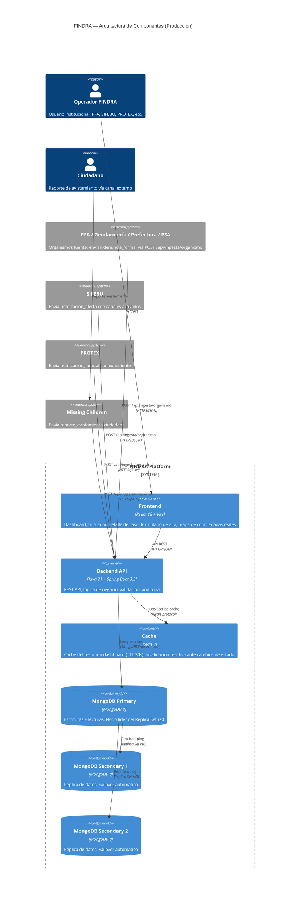
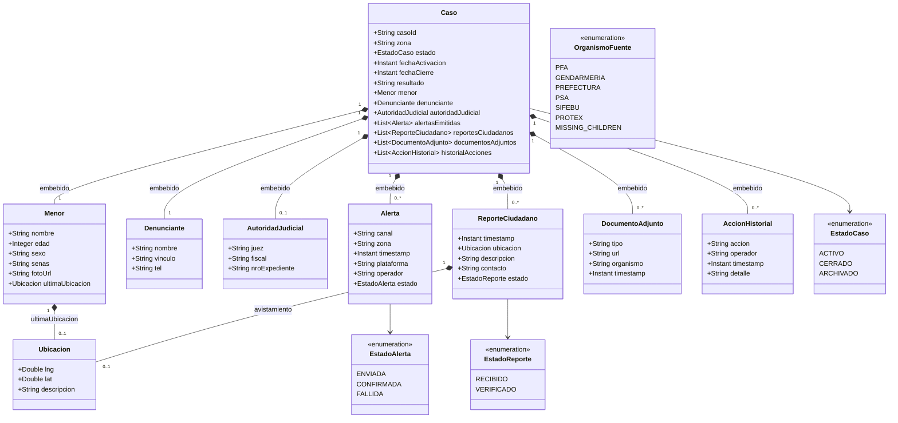
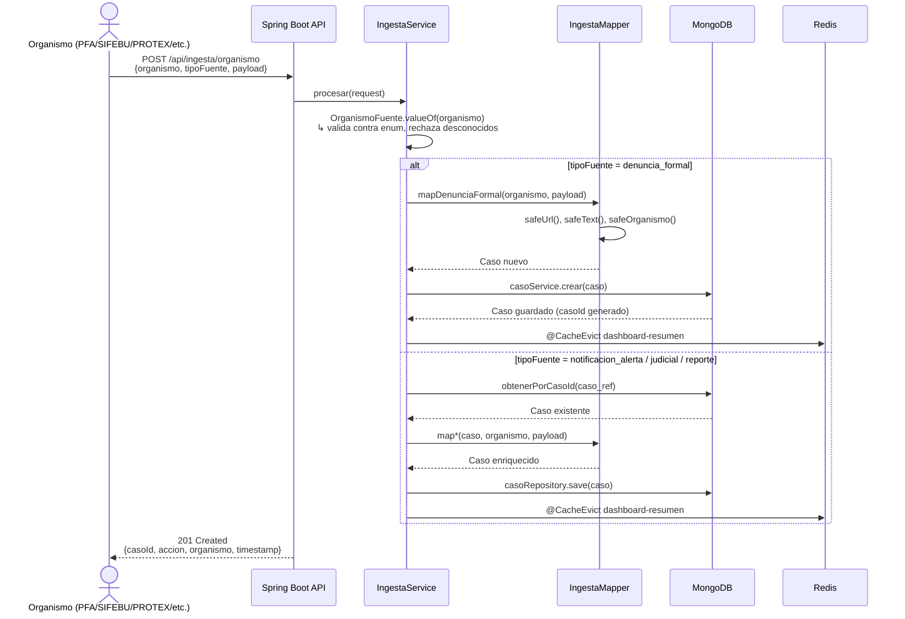
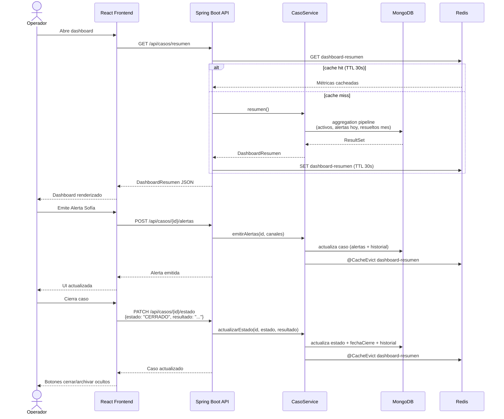

# FINDRA — Diagramas Técnicos

Este archivo centraliza los diagramas del sistema FINDRA. Cada sección indica qué criterios de la rúbrica impacta.

---

## Diagrama 1 — Arquitectura del Sistema

**Impacto en rúbrica:** Criterio 3 (Arquitectura propuesta), Criterio 11 (Arquitectura final), Criterio 13 (Documentación final)

Vista de componentes del sistema en producción, mostrando frontend, backend, capa de caché y persistencia distribuida.

> **Nota dev local:** MongoDB corre como instancia única en `localhost:27017`. La connection string de producción se configura via `MONGODB_URI` sin cambios en el código.

---

## Diagrama 2 — Modelo de Datos

**Impacto en rúbrica:** Criterio 2 (Modelado de datos NoSQL), Criterio 13 (Documentación final)

El modelo central es el documento `Caso` en MongoDB. Todos los sub-documentos son embebidos (document embedding) salvo referencias explícitas. La elección de embedding sobre referencias se justifica por la naturaleza de lectura del sistema: cada vista de detalle necesita todos los datos del caso sin joins.

**Decisión de diseño:** Todo embebido en un único documento MongoDB. Lectura O(1) por `casoId`. Sin joins. Adecuado para el patrón de acceso dominante (lectura completa del caso en detalle).

**Índices definidos:**
- `casoId` — único, lookup directo
- `estado` — filtro por estado activo/cerrado
- `menor.nombre` — búsqueda textual
- `zona` — filtro geográfico por zona

---

## Diagrama 3 — Pipeline E2E

**Impacto en rúbrica:** Criterio 6 (Pipeline de datos E2E), Criterio 9 (Documentación técnica), Criterio 13 (Documentación final)

Dos flujos principales: ingesta institucional (organismos externos) y operación interna (operador FINDRA desde el frontend).

### Flujo A — Ingesta multi-organismo

### Flujo B — Operación desde frontend

---

## Diagrama 4 — Comparativa Tecnológica

**Impacto en rúbrica:** Criterio 4 (Selección y justificación tecnológica)

| Dimensión | Alternativa A | Alternativa B | Decisión FINDRA | Justificación |
|-----------|--------------|--------------|-----------------|---------------|
| **Base de datos principal** | PostgreSQL (relacional) | **MongoDB 8** (documento) | MongoDB | Datos del caso son polimórficos (foto, GPS, docs judiciales, testimonios). Schema flexible evita migraciones ante nuevos tipos de fuente. |
| **Caché** | Caffeine (in-process) | **Redis 7** (distribuido) | Redis | Permite invalidación reactiva entre múltiples instancias del backend. Preparado para escala horizontal. TTL configurable por tipo de dato. |
| **Alta disponibilidad DB** | Sharding por zona geográfica | **Replica Set rs0** (3 nodos) | Replica Set | Sharding agrega complejidad operativa alta para el volumen actual. Replica Set provee failover automático con `writeConcern: majority` a costo operativo menor. |
| **Frontend** | Angular 17 | **React 18 + Vite** | React | Menor curva de aprendizaje, ecosistema más amplio para prototipado rápido. Vite reduce tiempos de build y HMR. |
| **Runtime backend** | Java 17 LTS | **Java 21 LTS** | Java 21 | Soporte LTS hasta 2031. Virtual Threads (Loom) disponibles para futura mejora de concurrencia sin refactor. |
| **Modelo de datos** | Referencias entre colecciones | **Embedding completo** | Embedding | Patrón de acceso dominante es lectura completa del caso. Embedding elimina joins, lectura O(1) por `casoId`. |

---

## Diagrama 5 — Grafo de Dependencias del Sistema

**Impacto en rúbrica:** Criterio 12 (Calidad global), Criterio 13 (Documentación final)

El grafo interactivo del sistema fue generado mediante análisis estático del repositorio completo con [graphify](https://github.com/graphify-ai/graphify). Permite navegar visualmente las relaciones entre todos los módulos, clases y conceptos del sistema.

**Artefacto:** [`docs/graph.html`](graph.html) — abrir en navegador para exploración interactiva.

### Métricas del grafo

| Métrica | Valor |
|---------|-------|
| Nodos totales | 396 |
| Relaciones (links) | 667 |
| Comunidades detectadas | 32 |
| Archivos de código analizados | 364 |
| Documentos y conceptos | 27 |
| Método de extracción | AST estático |

### Interpretación para la defensa

Las **32 comunidades** detectadas por el algoritmo de Louvain corresponden a los módulos lógicos del sistema: controllers, services, mappers, modelos, DTOs, repositorios, configuración y frontend. La alta cohesión intra-comunidad y el bajo acoplamiento entre capas confirman que la arquitectura en capas (Controller → Service → Repository → MongoDB) se refleja fielmente en la estructura del código.

Los **667 links** con **396 nodos** dan una densidad de ~1.7 relaciones por nodo, consistente con un sistema modular donde cada clase tiene responsabilidades acotadas (principio de responsabilidad única).

### Texto para incluir en el informe técnico

> **Análisis de dependencias del sistema**
>
> Con el objetivo de validar la cohesión arquitectónica del código implementado, se realizó un análisis estático completo del repositorio mediante graphify. El grafo resultante comprende **396 nodos** (364 archivos de código + 32 conceptos/documentos) y **667 relaciones**, agrupados en **32 comunidades** detectadas mediante el algoritmo de Louvain.
>
> Las comunidades identificadas se corresponden directamente con las capas de la arquitectura propuesta: capa de presentación (React + Vite), capa de API (Spring Controllers), capa de negocio (Services + Mappers), capa de datos (Repositories + MongoDB) y capa de caché (Redis). La densidad de relaciones inter-capa es consistente con el patrón de dependencia unidireccional diseñado: el frontend no conoce la persistencia, los services no conocen los controllers, y los mappers no tienen dependencias circulares.
>
> El grafo interactivo está disponible como artefacto adjunto en `docs/graph.html` y puede explorarse en cualquier navegador sin dependencias adicionales.
